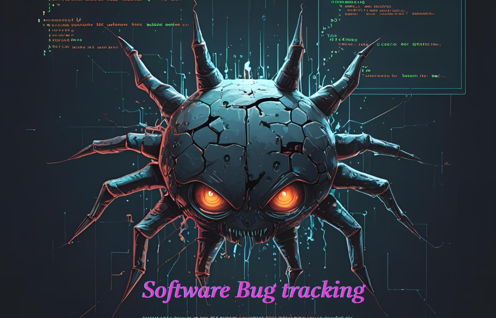

# Pro QA Bug Management (3D & Animated)
#### Enterprise-Ready Bug Tracking for Odoo 18

---

## Overview

**Pro QA Bug Management** is a next-level Odoo 18 module designed for Quality Assurance, Development, and Management teams.  
It brings 3D-animated Kanban boards, dashboards, and analytics—plus bulk bug assignment, tagging, and smart notification features—to help your organization manage and resolve software bugs efficiently.

---

## Features

- **Beautiful 3D Animated Kanban:** Modern, interactive board to track bugs visually.
- **Bulk Assignment Wizard:** Assign multiple bugs to a developer with just a few clicks.
- **Powerful Dashboards & Graphs:** Visualize bug status, assignments, and team performance.
- **Status Workflow:** New → Assigned → In Progress → Resolved → Closed/Cancelled.
- **Bug Tagging:** Organize, filter, and search bugs with tags.
- **Chatter Integration:** Log discussions and activities right on each bug.
- **Time to Solve:** See how long it takes to fix each bug.
- **Notifications & Activities:** Automated notifications and reminders on assignment and status change.
- **Role-based Security:** Users can manage/report their own bugs, managers see all.
- **Multi-language Support:** Translatable, with included Spanish (`es.po`) sample.

---

## Quick Start

1. **Copy the module folder** into your Odoo 18 `addons/` directory.

2. **Restart the Odoo server:**
